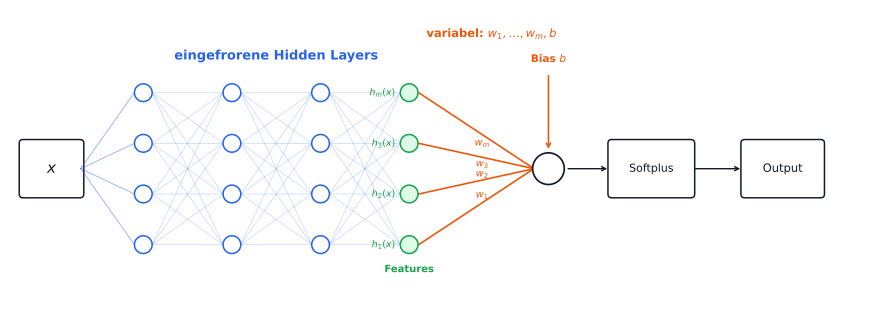

# Quellenunsicherheitsbasierte Gasexplorationsstrategie basierend auf Last-Layer-Laplace-Approximation für Konzentration und Gasquelle

Nach dem Training liefern das Konzentrationsnetz-MLP $c$ und das Quellen-MLP $q$ des PINN zunächst nur
jeweils eine optimale Feldschätzung 
$$
c(x)\geq 0,
\qquad
q(x)\geq 0.
$$
basierend auf den bisherigen Messungen und
den gegebenen Loss-Priors. Das Konzentrationsnetz approximiert also $x\mapsto c(x)$, das Quellennetz
approximiert $x\mapsto q(x)$. Beide Netze sind
insbesondere durch die stationäre Advektions-Diffusions-Gleichung gekoppelt:

$$
-D\Delta c
+\mathbf u\cdot\nabla c
-q
=0.
$$

## Suche des nächsten optimalen Messpunktes

Für eine aktive Exploration benötigen wir nun
ein Maß für die Unsicherheit der bisherigen Quellenschätzung, um zu beurteilen,
an welcher Position eine Konzentrationsmessung diese Unsicherheit
voraussichtlich am stärksten reduzieren würde.

Eine vollständige bayessche Behandlung würde sämtliche Gewichte und Biases
beider neuronaler Netze als unsicher betrachten. 

Daher nutzen wir eine Last-Layer-Laplace-Approximation, eine bewusste Vereinfachung dieses Vorgehens.
Nach dem normalen Training werden die Hidden Layers beider Netze eingefroren.
Sie dienen anschließend als feste, bereits gelernte Featureabbildungen:

$$
x\longmapsto h_c(x),
\qquad
x\longmapsto h_q(x).
$$

Als unsicher behandeln wir nur noch die Gewichte und den Bias des jeweils
letzten linearen Layers.

Gesucht ist der Punkt, an dem das Bekanntwerden der tatsächlichen Konzentration
$c(x)$ die Summe der verbleibenden Varianzen der Last-Layer-Quellenparameter

$$
\theta_q=(w_{q1},\ldots,w_{qm},b_q)^\top
$$

minimiert:

$$
\boxed{
x_{\mathrm{next}}
=
\arg\min_x
\operatorname{tr}
\left(
\operatorname{Cov}[\theta_q\mid c(x)]
\right)
}
$$

### Bedingte Kovarianz

Unter der gemeinsamen Gaußapproximation von $\theta_q$ und $c(x)$ ist die bedingte Kovarianz 
$\operatorname{Cov}[\theta_q\mid c(x)]$ ein Maß für die verbleibende Unsicherheit der 
Quellenparameter $\theta_q$ unter der Bedingung, dass $c(x)$ bekannt wird. Sie lässt sich
folgendermaßen berechnen:

$$
\operatorname{Cov}[\theta_q\mid c(x)]
=
\Sigma_{qq}
-
\operatorname{Cov}[\theta_q,c(x)]
\operatorname{Var}[c(x)]^{-1}
\operatorname{Cov}[c(x),\theta_q].
$$

Hier ist $\Sigma_{qq}=\operatorname{Cov}[\theta_q]$. Da $c(x)$ skalar ist und

$$
\operatorname{Cov}[c(x),\theta_q]
=
\operatorname{Cov}[\theta_q,c(x)]^\top,
$$

folgt

$$
\boxed{
\operatorname{Cov}[\theta_q\mid c(x)]
=
\Sigma_{qq}
-
\frac{
\operatorname{Cov}[\theta_q,c(x)]
\operatorname{Cov}[\theta_q,c(x)]^\top
}{
\operatorname{Var}[c(x)]
}
}.
$$

Da jedoch $\Sigma_{qq}$ nicht von $x$ abhängt folgt durch das Anwenden der Spur:

$$
\operatorname{tr}\left(\operatorname{Cov}[\theta_q\mid c(x)]\right)
=
\operatorname{tr}(\Sigma_{qq})
-
\frac{
\left\|\operatorname{Cov}[\theta_q,c(x)]\right\|_2^2
}{
\operatorname{Var}[c(x)]
}.
$$

Damit ist die ursprüngliche Minimierung äquivalent zu

$$
\boxed{
x_{\mathrm{next}}
=
\arg\max_x
\frac{
\left\|\operatorname{Cov}[\theta_q,c(x)]\right\|_2^2
}{
\operatorname{Var}[c(x)]
}
}.
$$

Für die Bestimmung des optimalen nächsten Messpunktes werden somit benötigt:

- $\operatorname{Var}[c(x)]$: die Unsicherheit der Konzentrationsprognose bei $x$,
- $\operatorname{Cov}[\theta_q,c(x)]$: die Kopplung zwischen den
  Last-Layer-Quellenparametern und der Konzentration bei $x$.

## Bestimmung der Unsicherheit der Konzentrationsprognose an einer Stelle $x$

$\operatorname{Var}[c(x)]$ beschreibt, wie unsicher die
Konzentrationsprognose des bisher trainierten Netzes an einem festen Kandidatenpunkt
$x$ ist. Zu ihrer Bestimmung wird die Unsicherheit der trainierten
Last-Layer-Parameter auf den skalaren Netzausgang übertragen.

Da die Hidden Layers nach dem Training als fest betrachtet werden, hängt
$c$ innerhalb der Last-Layer-Laplace-Approximation für ein festes $x$ nur noch von den
Last-Layer-Parametern $\theta_c$ des Konzentrationsnetzes ab. Deren
Unsicherheit darf dennoch nicht unabhängig vom Quellennetz bestimmt werden:
Beide Parametersätze wurden gemeinsam trainiert und sind insbesondere über
den Advektions-Diffusions-Loss gekoppelt. Deshalb wird zunächst ihre
gemeinsame Laplace-Kovarianz betrachtet und anschließend der für die
Konzentration relevante Block entnommen.

Die Last-Layer-Parameter beider Netze werden dazu zu einem gemeinsamen Vektor

$$
\theta=
\begin{bmatrix}
\theta_c\\
\theta_q
\end{bmatrix}
$$

zusammengefasst. Am trainierten Optimum $\theta^\ast$ wird die Hesse-Matrix
des gemeinsamen Losses $L$ bezüglich dieser Parameter berechnet. Die
Laplace-Approximation liefert die gemeinsame Kovarianzmatrix

$$
\Sigma
=
\left(
\nabla_\theta^2 L(\theta^\ast)+\lambda I
\right)^{-1}
=
\begin{bmatrix}
\Sigma_{cc} & \Sigma_{cq}\\
\Sigma_{qc} & \Sigma_{qq}
\end{bmatrix}.
$$

Der kleine Regularisierungsterm $\lambda I$ stabilisiert die Inversion. Der
Block $\Sigma_{cc}$ beschreibt die Kovarianz der Last-Layer-Parameter des
Konzentrationsnetzes.

Für die feste Featureabbildung $h_c(x)$ definieren wir den um den Bias-Eintrag
erweiterten Featurevektor

$$
\widetilde h_c(x)
=
\begin{bmatrix}
h_c(x)\\
1
\end{bmatrix}.
$$

Der Ausgang des letzten linearen Layers vor $softplus(\cdot)$ ist damit

$$
z_c(x)=\theta_c^\top\widetilde h_c(x),
$$

und die Konzentrationsprognose lautet

$$
c(x)=\operatorname{softplus}(z_c(x)).
$$

Um die Parameterunsicherheit auf die Konzentrationsprognose zu übertragen,
wird $c(x)$ bezüglich $\theta_c$ am Optimum linearisiert:

$$
\delta c(x)
\approx
\nabla_{\theta_c}c(x)^\top\delta\theta_c.
$$

Aus $\operatorname{Cov}[\delta\theta_c]=\Sigma_{cc}$ folgt mit der
Varianz einer linearen Transformation

$$
\boxed{
\operatorname{Var}[c(x)]
\approx
\nabla_{\theta_c}c(x)^\top
\Sigma_{cc}
\nabla_{\theta_c}c(x).
}
$$

Der benötigte Gradient kann für den letzten Layer direkt berechnet werden.
Mit

$$
z_c^\ast(x)
=
(\theta_c^\ast)^\top\widetilde h_c(x)
$$

und $\frac{d}{dz}\operatorname{softplus}(z)=\operatorname{sigmoid}(z)$ gilt

$$
\nabla_{\theta_c}c(x)
=
\operatorname{sigmoid}(z_c^\ast(x))\widetilde h_c(x).
$$

## Bestimmung der Kopplung von Last-Layer-Quellenparametern und der Konzentration

Zudem wird
$\operatorname{Cov}[\theta_q,c(x)]$ benötigt. Sie beschreibt, wie stark die
Unsicherheit der Konzentrationsprognose an $x$ mit der Unsicherheit der
Last-Layer-Quellenparameter zusammenhängt.

Aus der gemeinsamen Laplace-Kovarianz gilt für die Abweichungen vom
trainierten Optimum

$$
\operatorname{Cov}[\delta\theta_q,\delta\theta_c]
=
\Sigma_{qc}.
$$

Mit der bereits verwendeten Linearisierung

$$
\delta c(x)
\approx
\nabla_{\theta_c}c(x)^\top\delta\theta_c
$$

folgt aufgrund der linearen Transformation der Kovarianz

$$
\begin{aligned}
\operatorname{Cov}[\theta_q,c(x)]
&=
\operatorname{Cov}[\delta\theta_q,\delta c(x)]\\
&\approx
\operatorname{Cov}\!\left[
\delta\theta_q,
\nabla_{\theta_c}c(x)^\top\delta\theta_c
\right]\\
&=
\Sigma_{qc}\nabla_{\theta_c}c(x).
\end{aligned}
$$

Damit ist

$$
\boxed{
\operatorname{Cov}[\theta_q,c(x)]
\approx
\Sigma_{qc}\nabla_{\theta_c}c(x)
}.
$$

Die Ortsabhängigkeit entsteht durch den Konzentrationsgradienten bezüglich
der Last-Layer-Parameter. Der Block $\Sigma_{qc}$ überträgt diese
ortsabhängige Sensitivität auf die Quellenparameter. Mit

$$
\nabla_{\theta_c}c(x)
=
\operatorname{sigmoid}(z_c^\ast(x))\widetilde h_c(x)
$$

kann auch diese Größe unmittelbar aus der gemeinsamen Laplace-Kovarianz und
den Konzentrationsfeatures berechnet werden.

Einsetzen beider hergeleiteten Größen in das Auswahlkriterium ergibt den
Score

$$
s(x)
=
\frac{
\left\|\Sigma_{qc}\nabla_{\theta_c}c(x)\right\|_2^2
}{
\nabla_{\theta_c}c(x)^\top
\Sigma_{cc}
\nabla_{\theta_c}c(x)
},
$$

und damit

$$
\boxed{
x_{\mathrm{next}}=\arg\max_x s(x)
}.
$$

## Zusammenfassung

Nach dem gemeinsamen Training von Konzentrationsnetz $c$ und Quellennetz $q$
wird der nächste Messpunkt anhand der erwarteten Reduktion der
Last-Layer-Quellenparameterunsicherheit gewählt. Für eine rauschfreie
Konzentrationsmessung gilt in der linearisierten Laplace-Approximation:

$$
\boxed{
s(x)=
\frac{\left\|\Sigma_{qc}\nabla_{\theta_c}c\right\|_2^2}
{\nabla_{\theta_c}c^\top\Sigma_{cc}\nabla_{\theta_c}c},
\qquad
x_{\mathrm{next}}=\arg\max_x s(x).
}
$$

1. **Gemeinsame Kovarianz einmal pro trainiertem Modell berechnen.**
   Hidden Layers und Wind festhalten; die letzten Gewichte und Biases in der
   Reihenfolge $\theta=(w_c,b_c,w_q,b_q)^\top$ zusammenfügen. Den gemeinsamen
   Loss $L(\theta)$ auf festen Mess-, Rand- und Collocation-Punkten auswerten
   und zweimal nach diesem Vektor ableiten:

   $$
   H=\left.\nabla_\theta^2L(\theta)\right|_{\theta=\theta^\ast},
   \qquad
   \Sigma=(H+\lambda I)^{-1}.
   $$

2. **Gradienten für jeden Kandidatenpunkt $x$ berechnen.**
   Das Konzentrationsnetz bis zum letzten Hidden Layer auswerten und die 
   trainierten letzten Gewichte und den Bias verwenden:

   $$
   \widetilde h_c(x)=\begin{bmatrix}h_c(x)\\1\end{bmatrix},
   \qquad
   z_c^\ast(x)=(\theta_c^\ast)^\top\widetilde h_c(x),
   \qquad
   \nabla_{\theta_c}c=
   \operatorname{sigmoid}(z_c^\ast(x))\widetilde h_c(x).
   $$

3. **Score auswerten und maximieren.**
   Gradient und Kovarianzblöcke aus den vorherigen Schritten nutzen um $s(x)$ zu berechnen
   und den erreichbaren
   Kandidaten mit dem größten Score wählen. Die Formel setzt einen positiven
   Nenner voraus; bei exakt null Konzentrationsvarianz ist auch die
   Kreuzkovarianz null und es gibt in dieser Approximation keinen
   Informationsgewinn.
